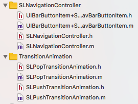

<link rel="stylesheet" href="http://yandex.st/highlightjs/6.2/styles/googlecode.min.css">
 

 

##自定义封装NavigationController

SLNavigationController，主要是沿用系统的导航栏控制器，目的在于便捷开发。但系统的导航栏有很大的限制，一般采用上述第一种自定义导航栏。

主要内容：



####一、SLNavigationController
与上述”自定义SLNavigationController” 基本相同，也加入了 右划返回 功能，同时针对系统的NavigationBar添加了 设置透明和设置 NavigationItem Title字体的大小

    /**
     *  设置self.NavigationBar 为透明
     * 
     */
	- (void)setNavigationBarBackGroundClean;

    /**
     *  设置NavigationBarTitleText字体大小
     *
     *  @param fontSize 字体大小
     */
	- (void)setNavigationBarTitleTextFontSize:(CGFloat)fontSize;

#####使用比较麻烦，需要获取对象才能调用 
Demo :

    SLNavigationController *Nav =(SLNavigationController *)self.navigationController;
    
    [Nav setNavigationBarBackGroundClean];
    
    [Nav setNavigationBarTitleTextFontSize:20];

####二、UIBarButtonItem + SLNavBarButtonItem 
封装了快速创建按钮的几个方法
#####1.设置 buttonContent的偏移

    /**
     *  设置 buttonContent的偏移
     *
     *  @param edgeInsets UIEdgeInsets
     */
	- (void)setButtonContentEdgeInsets:(UIEdgeInsets)edgeInsets {
    
    	UIButton *button         = (UIButton *)self.customView;
    	button.contentEdgeInsets = edgeInsets;
    
#####Demo:

    [rightBarItem2 setButtonContentEdgeInsets:UIEdgeInsetsMake(0, 10, 0, -10)];
    
    [rightBarItem1 setButtonContentEdgeInsets:UIEdgeInsetsMake(0, 10, 0, -10)];

#####1. 设置仅有文字的UIBarButtonItem的封装
	/**
     	*  设置仅有文字 UIBarButtonItem
     	*
	    *  @param buttonTitle      设置Normal状态下Button字的内容
 	    *  @param target     设置设置点击事件的target
	    *  @param action     设置点击事件触发的方法
	    *  限制button最大宽度 4个中文字 68
 	    *  @return UIBarButtonItem
        */
    + (id)itemWithTitle:(NSString *)buttonTitle target:(id)target action:(SEL)action {
    //(可选参数)
    UIColor *buttonTitleColor = [UIColor blackColor]; //buttonTitle默认正常状态的颜色
    UIColor *buttonHighLightTitleColor = [UIColor lightGrayColor]; //buttonTitle默认高亮状态的颜色
    CGFloat BoldSysFontSize = 17.0f;  //button默认字体大小
    CGFloat buttonSizeH = 44; //button默认高度
    
    //初始化
    UIButton *button = [UIButton buttonWithType:UIButtonTypeCustom];
    
    //设置文字
    [button setTitle:buttonTitle forState:UIControlStateNormal];
    
    //设置颜色
    [button setTitleColor:buttonTitleColor forState:UIControlStateNormal];
    [button setTitleColor:buttonHighLightTitleColor forState:UIControlStateHighlighted];
    
    //设置文字字体大小
    button.titleLabel.font = [UIFont boldSystemFontOfSize:BoldSysFontSize];
    
    //计算按钮动态宽度
    CGSize buttonSize = [buttonTitle sizeWithAttributes:@{NSFontAttributeName:[UIFont boldSystemFontOfSize:BoldSysFontSize]}];
    //设置文字过长切断
    button.titleLabel.lineBreakMode = NSLineBreakByClipping;
    //限制button最大宽度 4个中文字 68
    if (buttonSize.width > 68) {
        buttonSize.width = 68;
    }
    
    //设置Frame
    button.frame = CGRectMake(0, 0, buttonSize.width, buttonSizeH);
    
    //设置Button的触发事件
    [button addTarget:target action:action forControlEvents:UIControlEventTouchUpInside];

    return [[UIBarButtonItem alloc]initWithCustomView:button]; }
    
#####Demo：

    UIBarButtonItem *leftBarItem1 = [UIBarButtonItem itemWithTitle:@"POCO" target:self action:@selector(btnClick:)];
    

#####2.设置仅有图片的UIBarButtonItem的封装

		/**
 		  *  设置仅有图片(本地图片) UIBarButtonItem
 		  *
  		  *  @param imageNormal   buttonNormal状态下的UIImage
 		  *  @param imageSelected buttonSelected状态下的UIImage 为nil时默认不设置
 		  *  @param target       设置点击事件的target
 		  *  @param action       设置点击事件触发的方法
 	      *
 		  *  @return UIBarButtonItem
 		  */
		+ (instancetype)itemWithImageNormal:(UIImage *)imageNormal
                        imageSelected:(UIImage *)imageSelected
                               target:(id)target
                               action:(SEL)action {
    			//初始化
   				 UIButton *button = [UIButton buttonWithType:UIButtonTypeCustom];
    
    				[button setImage:imageNormal forState:UIControlStateNormal];
    				if (imageSelected) {
       				 [button setImage:imageSelected forState:UIControlStateHighlighted];
    				}
    
  				  //设置Frame
   				 CGFloat imageSizeW = 44;  //强制默认为44
   				 CGFloat imageSizeH = 44;
   				 button.frame = CGRectMake(0, 0 , imageSizeW , imageSizeH);
   				 button.contentMode = UIViewContentModeScaleAspectFit;
    
   				 //设置Button的触发事件
   				 [button addTarget:target action:action forControlEvents:UIControlEventTouchUpInside];
    
    			 return [[UIBarButtonItem alloc]initWithCustomView:button];
    			 }

  			 /**
    		   *  设置仅有图片(网络图片) UIBarButtonItem
    		   *
    		   *  @param imageNormalURL   buttonNormal状态下UIImage的URL
   			   *  @param imageSelectedURL buttonSelected状态下UIImage的URL 为nil时默认不设置
  			   *  @param placeholderImage button占位符的UIImage
   			   *
   			   *  @return UIBarButtonItem
   			   */
			+ (id)itemWithImageURL:(NSURL *)imageNormalURL
       				 imageSelected:(NSURL *)imageSelectedURL
    			  placeholderImage:(UIImage *)placeholderImage  target:(id)target action:(SEL)action {

    			//初始化
   			 UIButton *button = [UIButton buttonWithType:UIButtonTypeCustom];
    
   			 [button sd_setImageWithURL:imageNormalURL forState:UIControlStateNormal placeholderImage:placeholderImage];
    			if (imageSelectedURL) {
     			   [button sd_setImageWithURL:imageSelectedURL forState:UIControlStateSelected placeholderImage:placeholderImage];
   			 }
    
    			//设置Frame
    			CGFloat imageSizeW = 44;  //强制默认为44
    			CGFloat imageSizeH = 44;
   			 button.frame = CGRectMake(0, 0 , imageSizeW , imageSizeH);
    			button.contentMode = UIViewContentModeScaleAspectFill;

    			//设置Button的触发事件
   			    [button addTarget:target action:action forControlEvents:UIControlEventTouchUpInside];
    
    			return [[UIBarButtonItem alloc]initWithCustomView:button];
  				}

#####Demo:

			UIBarButtonItem *leftBarItem2 = [UIBarButtonItem itemWithImageNormal:[UIImage imageNamed:@"addTag"] imageSelected:nil target:self action:@selector(btnClick:)];
    
   		    UIBarButtonItem *leftBarItem3 = [UIBarButtonItem itemWithImageURL:[NSURL	URLWithString:@"http://www.icosky.com/icon/png/Media/Buttons/Button%20Refresh.png"]  
   		    									                 imageSelected:nil 
  											                  placeholderImage:[UIImage imageNamed:@"addTag"]  
   																		target:self 
   																		action:@selector(btnClick:)];
   		    
   		    
			
#####3.设置含有文字图片的UIBarButtonItem的封装

			/**
			 *  设置含有文字图片(本地图片) UIBarButtonItem
			 *
 			*  @param buttonTitle   buttonTitle 文字Title
 			*  @param imageNormal   buttonNormal状态下的UIImage
 			*  @param imageSelected buttonSelected状态下的UIImage
 			*  @param isdefault     系统默认 图片在左，文字在右； 非系统默认 图片子啊右，文字在左
 			*  @param target       设置点击事件的target
		    *  @param action       设置点击事件触发的方法
 			*
 			*  @return UIBarButtonItem
			 */
			+ (id)itemWithTitleAndImageWithTitle:(NSString *)buttonTitle
            			          AndImageNormal:(UIImage *)imageNormal
                  			     imageSelected:(UIImage *)imageSelected
                          			   default:(BOOL)isdefault
                            		    target:(id)target
                           			    action:(SEL)action {
   			    //(可选参数)
    			UIColor *buttonTitleColor = [UIColor blackColor];
    			UIColor *buttonHighLightTitleColor = [UIColor lightGrayColor];
    			CGFloat BoldSysFontSize = 17.0f;
    			CGFloat buttonSizeH = 44; //强制默认为44
    			CGFloat imageSizeW = 44;  //强制默认为44
    			CGFloat interval = 1.0; //titleLabel与imageView的间隔
    
    			//初始化
   			    UIButton *button = [UIButton buttonWithType:UIButtonTypeCustom];
    
   			   //设置文字
   			   [button setTitle:buttonTitle forState:UIControlStateNormal];
    
   			 //设置颜色
    			[button setTitleColor:buttonTitleColor forState:UIControlStateNormal];
    			[button setTitleColor:buttonHighLightTitleColor forState:UIControlStateHighlighted];
    
    			//设置文字字体大小
   			 button.titleLabel.font = [UIFont boldSystemFontOfSize:BoldSysFontSize];
    
    			//按钮button
   			 [button setImage:imageNormal forState:UIControlStateNormal];
   			 if (imageSelected) {
        			[button setImage:imageSelected forState:UIControlStateHighlighted];
    		 }
    
    
    		  //设置 Title的 Frame
    
   			 //计算按钮动态宽度
   			 CGSize titleSize = [buttonTitle sizeWithAttributes:@{NSFontAttributeName:[UIFont boldSystemFontOfSize:BoldSysFontSize]}];
    		//设置文字过长切断
    		button.titleLabel.lineBreakMode = NSLineBreakByClipping;
  		  //限制button最大宽度 4个中文字 68
   		 if (titleSize.width > 68) {
       		 titleSize.width = 68;
 		   }
    
   		 //设置 image的 Frame
   		 button.frame = CGRectMake(0, 0, titleSize.width + imageSizeW + interval , buttonSizeH);
    
   		 //设置image与Title之间的间隔
    		if (!isdefault) {
       		 [button setImageEdgeInsets:UIEdgeInsetsMake(0, titleSize.width + interval, 0,-(titleSize.width + interval) )];
      		  [button setTitleEdgeInsets:UIEdgeInsetsMake(0, -(imageSizeW + interval) , 0, imageSizeW + interval )];
   		 }
    
  		  //设置Button的触发事件
  		  [button addTarget:target action:action forControlEvents:UIControlEventTouchUpInside];
	
    	 return [[UIBarButtonItem alloc]initWithCustomView:button];
		}

			/**
 			*   设置含有文字图片(网络图片) UIBarButtonItem
 			*
 			*  @param buttonTitle      buttonTitle 文字Title
			 *  @param imageNormalURL   buttonNormal状态下UIImage的URL
			 *  @param imageSelectedURL buttonSelected状态下UIImage的URL 为nil时默认不设置
			 *  @param placeholderImage button占位符的UIImage
 			*  @param isdefault        系统默认 图片在左，文字在右； 非系统默认 图片子啊右，文字在左
			*  @param target           设置点击事件的target
 			*  @param action           设置点击事件触发的方法
 			*
 			*  @return UIBarButtonItem
 			*/
			+ (id)itemWithTitleAndImageWithTitle:(NSString *)buttonTitle
           			        AndImageNormalURL:(NSURL *)imageNormalURL
                			       imageSelected:(NSURL *)imageSelectedURL
                			    placeholderImage:(UIImage *)placeholderImage
                      			       default:(BOOL)isdefault
                          			    target:(id)target
                         			     action:(SEL)action {
    			//(可选参数)
   			  UIColor *buttonTitleColor = [UIColor blackColor];
  			  UIColor *buttonHighLightTitleColor = [UIColor lightGrayColor];
  			  CGFloat BoldSysFontSize = 17.0f;
  			  CGFloat buttonSizeH = 44; //强制默认为44
  			  CGFloat imageSizeW = 44;  //强制默认为44
 			  CGFloat interval = 1.0; //titleLabel与imageView的间隔
    
   			 //初始化
   			 UIButton *button = [UIButton buttonWithType:UIButtonTypeCustom];
    
   			 //设置文字
   			 [button setTitle:buttonTitle forState:UIControlStateNormal];
    
   			 //设置颜色
   			 [button setTitleColor:buttonTitleColor forState:UIControlStateNormal];
   			 [button setTitleColor:buttonHighLightTitleColor forState:UIControlStateHighlighted];
    
    		  //设置文字字体大小
   			 button.titleLabel.font = [UIFont boldSystemFontOfSize:BoldSysFontSize];
    
    		 //按钮图片
    			[button sd_setImageWithURL:imageNormalURL forState:UIControlStateNormal placeholderImage:placeholderImage];
   			 if (imageSelectedURL) {
        			[button sd_setImageWithURL:imageSelectedURL forState:UIControlStateNormal placeholderImage:placeholderImage];
        
   			 }
    
   			 //设置 Title的 Frame
   			 //计算按钮动态宽度
  			  CGSize titleSize = [buttonTitle sizeWithAttributes:@{NSFontAttributeName:[UIFont boldSystemFontOfSize:BoldSysFontSize]}];
   			 //设置文字过长切断
   			 button.titleLabel.lineBreakMode = NSLineBreakByClipping;
    		//限制button最大宽度 4个中文字 68
    		if (titleSize.width > 68) {
      			  titleSize.width = 68;
   			 }
    
   			 //设置 image的 Frame
  			  button.frame = CGRectMake(0, 0, titleSize.width + imageSizeW + interval , buttonSizeH);
    
   			 //设置image与Title之间的间隔
    			if (!isdefault) {
      			  [button setImageEdgeInsets:UIEdgeInsetsMake(0, titleSize.width + interval, 0,-(titleSize.width + interval) )];
      			  [button setTitleEdgeInsets:UIEdgeInsetsMake(0, -(imageSizeW + interval) , 0, imageSizeW + interval )];
  			  }
   
    		//设置Button的触发事件
   			 [button addTarget:target action:action forControlEvents:UIControlEventTouchUpInside];
    
   		  	 return [[UIBarButtonItem alloc]initWithCustomView:button];
   		  	 }
   		  	 
#####Demo:
 	
 	 		UIBarButtonItem *rightBarItem1 =[UIBarButtonItem itemWithTitleAndImageWithTitle:@"POCO"
 	 		  AndImageNormalURL:[NSURL URLWithString:@"http://www%20Refresh.png"] 				  imageSelected:nil 
 	 		  placeholderImage:[UIImage imageNamed:@"addTag"] 
 	 		  		   default:YES
	 		  		    target:self 
	 		  		    action:@selector(btnClick:)];
 	 		          
 	 		          
       		UIBarButtonItem *rightBarItem2 =[UIBarButtonItem itemWithTitleAndImageWithTitle:@"COCOP" 
       		    AndImageNormal:[UIImage imageNamed:@"addTag"]  
       		     imageSelected:nil 
       		           default:NO 
       		            target:self 
       		            action:@selector(btnClick:)];

