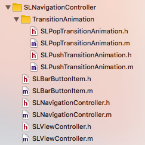
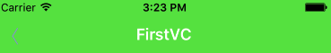
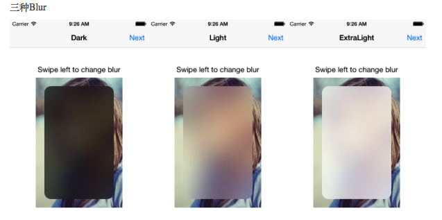

                                      
#SLNavigationController 说明文档

##介绍：

###SLNavigationController 依据需求 分成 两个独立的模块对应不同的场景 :
	
* 通过隐藏NavigationBar，然后自定义一个UIVIew来代替NavigationBar进行的（以下简称“自定义的SLNavigationController”）；

* 另一个是在NavigationController 的基础上进行优化和封装(以下简称“封装的SLNavigationController”)。**

##目录：

<link rel="stylesheet" href="http://yandex.st/highlightjs/6.2/styles/googlecode.min.css">
 

 

===
##1.自定义的NavigationController
使用自定义导航控制器需要包含 SLNavigationController 文件夹的文件
####一、文件结构：


 
####二、功能使用：

###——设置右划手势返回功能
**(由“SLNavigationController” 和 “SLPopTransitionAnimation”、“SLPushTransitionAnimation”【转场动画协议】组成)**
	
#####使用:  
* **通过设置 SLNavigationController的  InteractivePopGestureRecognizerType 属性来设置 手势的类型**

#####具体为：
      

	typedef NS_ENUM(NSUInteger, InteractivePopGestureRecognizerType) {
	InteractivePopGestureRecognizerNone, //没有返回手势
	InteractivePopGestureRecognizerEdge, //边缘返回手势
	InteractivePopGestureRecognizerFullScreen //全屏返回手势 
 	};
    
#####Demo：
    SLListViewController  * ListVC = [[SLListViewController alloc]init];
    SLNavigationController * Nav = [[SLNavigationController alloc]initWithRootViewController:ListVC];
    
    Nav.interactivePopGestureRecognizerType = InteractivePopGestureRecognizerFullScreen; //<--设置全屏返回手势
    
**PS：自定义UIView的导航栏没有默认返回按钮 ，需要在下一个子视图中自定义返回按钮 或 直接用右划返回手势。**

 ===
 
 
###——“SLViewController”、“SLBarButtonItem”

**以下功能需 视图控制器(VC) 继承于 SLViewController 来进行使用  
EG：SLFirstViewController 继承于 SLViewController **

    #import "SLViewController.h"   
    
    @interface SLFirstViewController : SLViewController
    
    @end

####1.设置导航栏标题文字
#####使用：
通过继承SLViewController 设置 self.navigationTitle 属性进行赋值。

**PS :在用self.navigationTitle进行设置标题的时候，代码中限制了字体的个数为 6个字(102)控件的宽度；可以通过使用self.navigationTitleView 来自定义控件解决需求**。
#####Demo：
		//设置 navigationTitle
       	self.navigationTitle = @"FirstVC";

####2.设置导航栏自定义TitleView
	 
#####使用：
通过继承SLViewController设置  self.navigationTitleView属性进行赋值。

#####Demo:
		 //在TitleView 添加控件
		 self.navigationTitleView = self.slider;　//<-- 设置导航栏自定义TitleView代码

 		 - (UISlider *)slider
		{
   			 if (_slider == nil) {
       			 _slider = [[UISlider alloc]initWithFrame:CGRectMake(0, 0, 150, 3)];
      		    [_slider addTarget:self action:@selector(ChangeSliderValue:) forControlEvents:UIControlEventValueChanged];
 								 }
   			     return _slider;
   	    }

####3.设置导航栏的 Left Right BarButtonItem

#####使用：（SLViewController.h中 包含了 SLBarButtonItem.h） SLBarButtonItem 是对Button的创建进行封装,可以简捷地创建不同类型的按钮。（SLBarButtonItem详情使用，下一段会有具体说明）

######>1.设置单个BarButtonItem 
　　通过继承 **SLViewController** 设置 **self.navigationLeftButton** OR ** self.navigationRightButton** 属性进行赋值。
#####Demo：
   * 设置左边按钮：

	    //图片按钮
    	SLBarButtonItem *leftButtonBack = [SLBarButtonItem buttonWithImageNormal:[UIImage imageNamed:@"back"] imageSelected:nil];
    	[leftButtonBack addTarget:self action:@selector(ClickBackButton:) forControlEvents:UIControlEventTouchUpInside];
    	
        self.navigationLeftButton = leftButtonBack;  //<--设置左边BarButtonItem
	
* 设置右边按钮
	    
	    //文字按钮
    	SLBarButtonItem *rightButtonBack = [SLBarButtonItem buttonWithTitle:@"返回"];
    	 [rightButtonBack addTarget:self action:@selector(ClickBackButton:) forControlEvents:UIControlEventTouchUpInside];
    	 
    	self.navigationRightButton = rightButtonBack; //<--设置右边BarButtonItem
	
#####>2.设置BarButtonItems 集合
　　通过继承SLViewController设置 **self.navigationLeftButtons** OR **self.navigationRightButtons** 属性进行赋值。（PS：按钮集布局是通过Masnory来进行布局的）
		
#####Demo:
* 设置左边按钮集合：
        
        ＞>第一步：创建按钮
 	 	//创建图片按钮(本地)
  	  	SLBarButtonItem *leftButtonBack = [SLBarButtonItem buttonWithImageNormal:[UIImage imageNamed:@"back"] imageSelected:nil];
  	    [leftButtonBack addTarget:self action:@selector(ClickBackButton:) forControlEvents:UIControlEventTouchUpInside];
  	    
 		SLBarButtonItem *leftButton2 = [SLBarButtonItem buttonWithTitle:@"文字"];
 		
  	  	//添加图片按钮(网络)  （建议 采取44 * 44格式 ）
 	   SLBarButtonItem *leftButton3 = [SLBarButtonItem buttonWithImageNormalURL:[NSURL URLWithString:@"http://	hammerjs.github.io/assets/img/github-icon.png"] imageSelected:[NSURL URLWithString:@"http://static.wixstatic.com/media/94f355_8ef96f732b7146c1828dc5e474bf770f.gif"] placeholderImage:[UIImage imageNamed:@"addTag"]];
            
       ＞>第二步：使用数组保存按钮
      	//设置Items 数组
  	  	NSArray *leftButtonItems = @[leftButtonBack,leftButton2,leftButton3];
  	  
  	   ＞>第三步：直接赋值
  	    self.navigationLeftButtons = leftButtonItems;  //<--设置左边按钮集合
		
		
* 设置右边按钮集合：
	
  （参考设置左边按钮↑）
	
#####>3.设置导航栏颜色属性（由于隐藏了NavgiationBar，通过自定义NavigationView来代替NavigationBar，所以设置导航栏颜色的对象是NavigationView）
######1).导航栏默认颜色 
　　在SLViewController.m 中设置了一个宏(#define DEFAULT_NAVIGATIONCOLOR)记录导航栏的默认颜色，通过修改宏的默认颜色参数来统一设置导航栏默认背景颜色 
######2).设置导航栏的背景色
#####使用：
　　通过继承SLViewController设置 self.navigationAlpha属性进行赋值。
#####Demo： 
    
       self.navigationBackgroundColor = [UIColor greenColor]; 
    或 self.navigationView.background = [UIColor greenColor];
#####3).改变NavigationView的背景透明度
#####使用：
通过继承SLViewController设置 self.navigationAlpha属性进行赋值。
#####Demo:

		 self.navigationAlpha = 1 ;   //Range:(0~1)
#####4).设置导航栏毛玻璃效果(设置毛玻璃效果会自动取消了背景色)—IOS8及以上 才提供毛玻璃图层 使用
#####使用：
直接调用方法。(通过把毛玻璃图层加入到navigationView上达成效果)

PS:为了能体现出毛玻璃效果，如果设置毛玻璃效果后，会取消了背景颜色。 “cancelBlurOfNavigationBar” 会还原恢复默认的颜色。
 
 （默认颜色是一个宏定义默认的颜色，使用者可以通过修改宏定义，也可以使用 self.navigationBackgroundColor来重新设置颜色）
		
* 毛玻璃效果有
		
			typedef NS_ENUM(NSInteger, UIBlurEffectStyle) {
  			  UIBlurEffectStyleExtraLight,
   			  UIBlurEffectStyleLight,
   			  UIBlurEffectStyleDark
			 } NS_ENUM_AVAILABLE_IOS(8_0);

 * 效果为：
  
#####Demo：
		  
		 //设置毛玻璃效果 （设置后 取消了背景颜色）
		 [self setBlurOfNavigationBarWithStyle:UIBlurEffectStyleExtraLight];
    
         //取消毛玻璃效果 （还原恢复  SLViewController中 宏(DEFAULT_NAVIGATIONCOLOR) 设定的背景颜色）
  		 [self cancelBlurOfNavigationBar];
#####5).设置状态栏颜色
#####使用：
直接调用方法。状态栏目前颜色有两种，黑色和白色。默认黑色。

		 typedef NS_ENUM(NSInteger, UIStatusBarStyle) {
	    UIStatusBarStyleDefault                                     = 0, // Dark content, for use on light backgrounds
	    UIStatusBarStyleLightContent     NS_ENUM_AVAILABLE_IOS(7_0) = 1, // Light content, for use on dark backgrounds
	    UIStatusBarStyleBlackTranslucent NS_ENUM_DEPRECATED_IOS(2_0, 7_0, "Use UIStatusBarStyleLightContent") = 1, UIStatusBarStyleBlackOpaque      NS_ENUM_DEPRECATED_IOS(2_0, 7_0, "Use UIStatusBarStyleLightContent") = 2,
	    } 
#####Demo：
			 [self setStatusBarStyle:UIStatusBarStyleDefault];
			 
===
###——详细内容(SLBarButtonItem.m)：

**在项目中继承的SLViewController 包含头文件SLBarButtonItem，SLBarButtonItem是基于UIButton封装成的，用于便捷创建按钮，
在SLBarButtonItem 中有5个类方法提供快速创建UIButton。**

######//创建文字按钮
     
     /**
      *  创建按钮(仅有文字)
  	  *
      *  @param buttonTitle 文字Title
      *
      *  @return SLBarButtonItem
      */
     + (instancetype)buttonWithTitle:(NSString *)buttonTitle; 
.m 内容

 	+ (instancetype)buttonWithTitle:(NSString *)buttonTitle {
    //   (可选Options)
    //   SLbuttonTitleColor //buttonTitle默认正常状态的颜色
    //   SLbuttonHighLightColor //buttonTitle默认高亮状态的颜色
    //   SLButtonBoldSysFontSize  //button默认字体大小
    //   CGFloat buttonSizeH = 44; //button默认高度
    
    //初始化
    SLBarButtonItem *barButtonItem = [super buttonWithType:UIButtonTypeCustom];
    
    //设置文字
    [barButtonItem setTitle:buttonTitle forState:UIControlStateNormal];
    
    //设置颜色
    [barButtonItem setTitleColor:[barButtonItem valueForOptionskey:SLbuttonTitleColor] forState:UIControlStateNormal];
    [barButtonItem setTitleColor:[barButtonItem valueForOptionskey:SLbuttonHighLightColor] forState:UIControlStateHighlighted];
    
    //设置文字字体大小
    barButtonItem.titleLabel.font = [UIFont boldSystemFontOfSize:[[barButtonItem valueForOptionskey:SLButtonBoldSysFontSize]floatValue]];
    
        //计算按钮动态宽度
        CGSize buttonSize = [buttonTitle sizeWithAttributes:@{NSFontAttributeName:[UIFont boldSystemFontOfSize:[[barButtonItem valueForOptionskey:SLButtonBoldSysFontSize]floatValue]]}];
        //设置文字过长切断
        barButtonItem.titleLabel.lineBreakMode = NSLineBreakByClipping;
        //限制button最大宽度 4个中文字 68
        if (buttonSize.width > 68) {
            buttonSize.width = 68;
        }
    
    //设置Frame
    barButtonItem.frame = CGRectMake(0, 0, buttonSize.width, [[barButtonItem valueForOptionskey:SLbuttonSizeH]floatValue]);
    
    return barButtonItem;
    
       }
       
**给出了可选参数，用于设置UIButton中的Title字体相关内容
通过setOptions 来自定义 button 的一些属性，(<a href ="#options">Options的详细内容</a>)**
 		
       
 Demo：
			
	  //文字按钮
    SLBarButtonItem *rightButtonBack = [SLBarButtonItem buttonWithTitle:@"返回"];
    
    //自定义Options
    [rightButtonBack setOptions:@{SLbuttonTitleColor:[UIColor orangeColor],
                              SLbuttonHighLightColor:[UIColor greenColor],
                             SLButtonBoldSysFontSize:@24
                                  }];
    [rightButtonBack addTarget:self action:@selector(ClickBackButton:) forControlEvents:UIControlEventTouchUpInside];
    
    self.navigationRightButton = rightButtonBack; //添加 单个 rightButtonItem 的方法
		
		===================================================================================
       创建UIButton的时候因为导航栏宽度的原因，也限制了button的宽度，默认为4个中文字体 68，超长会被截掉
       //限制button最大宽度 4个中文字 68
        if (buttonSize.width > 68) {
            buttonSize.width = 68;
        }

===
######//创建图标按钮(本地)

	/**
 	*  创建按钮(仅有有图片-本地)
    *
    *  @param imageNormal   buttonNormal状态下的UIImage
    *  @param imageSelected buttonSelected状态下的UIImage 为nil时默认不设置
    *
    *  @return SLBarButtonItem
    */
    + (instancetype)buttonWithImageNormal:(UIImage *)imageNormal imageSelected:(UIImage *)imageSelected;

.m 内容
	  
	   
      + (instancetype)buttonWithImageNormal:(UIImage *)imageNormal imageSelected:(UIImage *)imageSelected
	{
    //初始化
    SLBarButtonItem *barButtonItem = [super buttonWithType:UIButtonTypeCustom];
 
    [barButtonItem setImage:imageNormal forState:UIControlStateNormal];
    if (imageSelected) {
        
        [barButtonItem setImage:imageSelected forState:UIControlStateHighlighted];
        
    }

    //设置Frame
    
    CGFloat imageSizeW = 44;  //强制默认为44
    CGFloat imageSizeH = 44;
    
    barButtonItem.frame = CGRectMake(0, 0 , imageSizeW , imageSizeH);
    
    barButtonItem.contentMode = UIViewContentModeScaleAspectFit;
    
    return barButtonItem;
    }

Demo：

    //图片按钮
    SLBarButtonItem *leftButtonBack = [SLBarButtonItem buttonWithImageNormal:[UIImage imageNamed:@"back"] imageSelected:nil];
    [leftButtonBack addTarget:self action:@selector(ClickBackButton:) forControlEvents:UIControlEventTouchUpInside];
    
    self.navigationLeftButton = leftButtonBack; //添加 单个 leftButtonItem 的方法

===
#####//创建图标按钮(网络)
    
    /**
     *  创建按钮(仅有图片-网络)
     *
     *  @param imageNormalURL   buttonNormal状态下UIImage的URL
     *  @param imageSelectedURL buttonSelected状态下UIImage的URL 为nil时默认不设置
     *  @param placeholderImage button占位符的UIImage
     *
     *  @return SLBarButtonItem
     */	
	+ (instancetype)buttonWithImageNormalURL:(NSURL *)imageNormalURL
                              imageSelected:(NSURL *)imageSelectedURL
                           placeholderImage:(UIImage *)placeholderImage;
.m 内容
	
	+ (instancetype)buttonWithImageNormalURL:(NSURL *)imageNormalURL
                               imageSelected:(NSURL *)imageSelectedURL
                            placeholderImage:(UIImage *)placeholderImage {
  
    //初始化
    SLBarButtonItem *barButtonItem = [super buttonWithType:UIButtonTypeCustom];
    
    [barButtonItem sd_setImageWithURL:imageNormalURL forState:UIControlStateNormal placeholderImage:placeholderImage];
    if (imageSelectedURL) {
        [barButtonItem sd_setImageWithURL:imageSelectedURL forState:UIControlStateSelected placeholderImage:placeholderImage];
    }
    
    //设置Frame
    CGFloat imageSizeW = 44;  //强制默认为44
    CGFloat imageSizeH = 44;
    barButtonItem.frame = CGRectMake(0, 0 , imageSizeW , imageSizeH);
    barButtonItem.contentMode = UIViewContentModeScaleAspectFill;
    
    return barButtonItem;
    }

Demo：

    //添加图片按钮(网络)  （建议 采取44 * 44格式 ）
    SLBarButtonItem *leftButton3 = [SLBarButtonItem buttonWithImageNormalURL:[NSURL URLWithString:@"http://hammerjs.github.io/assets/img/github-icon.png"] imageSelected:[NSURL URLWithString:@"http://static.wixstatic.com/media/94f355_8ef96f732b7146c1828dc5e474bf770f.gif"] placeholderImage:[UIImage imageNamed:@"addTag"]];

===
#####//创建 文字图片(本地)  建议图片大小为 44 * 44
		
		/**
	     *  创建按钮(文字图片-本地)  建议图片大小为 44 * 44
 	     *
 		 *  @param buttonTitle   buttonTitle 文字Title
		 *  @param imageNormal   buttonNormal状态下的UIImage
		 *  @param imageSelected buttonSelected状态下的UIImage
		 *  @param isdefault     系统默认 图片在左，文字在右； 非系统默认 图片子啊右，文字在左
 		 *
		 *  @return SLBarbuttonItem
 		 */
		+ (instancetype)buttonWithTitle:(NSString *)buttonTitle
                        AndImageNormal:(UIImage *)imageNormal
              		     imageSelected:(UIImage *)imageSelected
                       default:(BOOL)isdefault;  //default 系统默认为 左边图片右边文字  非默认为左边文字右边图片
                       
 
.m 内容
		 
	+ (instancetype)buttonWithTitle:(NSString *)buttonTitle
                AndImageNormal:(UIImage *)imageNormal
                 imageSelected:(UIImage *)imageSelected
                       default:(BOOL)isdefault {
    //   (可选Options)
    //   SLbuttonTitleColor //buttonTitle默认正常状态的颜色
    //   SLbuttonHighLightColor //buttonTitle默认高亮状态的颜色
    //   SLButtonBoldSysFontSize  //button默认字体大小
    //   CGFloat buttonSizeH = 44; //button默认高度
    //   SLInterval //设置 button TitleLabel 与 imageView 之间的间隙
    
    //初始化
    SLBarButtonItem *barButtonItem = [super buttonWithType:UIButtonTypeCustom];
    
    //设置文字 Title
    [barButtonItem setTitle:buttonTitle forState:UIControlStateNormal];
    
    //设置颜色
    [barButtonItem setTitleColor:[barButtonItem valueForOptionskey:SLbuttonTitleColor] forState:UIControlStateNormal];
    [barButtonItem setTitleColor:[barButtonItem valueForOptionskey:SLbuttonHighLightColor] forState:UIControlStateHighlighted];
    
    //设置文字字体大小
    barButtonItem.titleLabel.font = [UIFont boldSystemFontOfSize:[[barButtonItem valueForOptionskey:SLButtonBoldSysFontSize]floatValue]];
    
    //按钮图片 image
    [barButtonItem setImage:imageNormal forState:UIControlStateNormal];
    if (imageSelected) {
        [barButtonItem setImage:imageSelected forState:UIControlStateHighlighted];
    }
    
    //设置 Title的 Frame
    
    //计算按钮动态宽度
    CGSize titleSize = [buttonTitle sizeWithAttributes:@{NSFontAttributeName:[UIFont boldSystemFontOfSize:[[barButtonItem valueForOptionskey:SLButtonBoldSysFontSize]floatValue]]}];
    //设置文字过长切断
    barButtonItem.titleLabel.lineBreakMode = NSLineBreakByClipping;
    //限制button最大宽度 4个中文字 68
    if (titleSize.width > 68) {
        titleSize.width = 68;
    }
    
    //设置 image的 Frame
    
    CGFloat imageSizeW = 44;  //强制默认为44
    
    CGFloat interval = [[barButtonItem valueForOptionskey:SLInterval] floatValue]; //titleLabel与imageView的间隔
    
    barButtonItem.frame = CGRectMake(0, 0, titleSize.width + imageSizeW + interval , [[barButtonItem valueForOptionskey:SLbuttonSizeH] floatValue]);
    
    barButtonItem.deafult = 11;
    
    if (!isdefault) {
        barButtonItem.deafult = 10  ;
        [barButtonItem setImageEdgeInsets:UIEdgeInsetsMake(0, titleSize.width + interval, 0,-(titleSize.width + interval) )];
        [barButtonItem setTitleEdgeInsets:UIEdgeInsetsMake(0, -(imageSizeW + interval) , 0, imageSizeW + interval )];
    }
    
    return barButtonItem; 
    
    	}

===

//创建 文字图片(网络)   建议图片大小为 44 * 44

		/**
 		 *  创建按钮(文字图片-网络)
         *
         *  @param buttonTitle      buttonTitle 文字Title
 		 *  @param imageNormalURL   buttonNormal状态下UIImage的URL
 		 *  @param imageSelectedURL buttonSelected状态下UIImage的URL 为nil时默认不设置
 		 *  @param placeholderImage button占位符的UIImage
		 *  @param isdefault        系统默认 图片在左，文字在右； 非系统默认 图片子啊右，文字在左
 		 *
		 *  @return SLBarbuttonItem
		 */
		+ (instancetype)buttonWithTitle:(NSString *)buttonTitle
             AndImageNormalURL:(NSURL *)imageNormalURL
                 imageSelected:(NSURL *)imageSelectedURL
              placeholderImage:(UIImage *)placeholderImage
                       default:(BOOL)isdefault;
.m 内容

		+ (instancetype)buttonWithTitle:(NSString *)buttonTitle
             AndImageNormalURL:(NSURL *)imageNormalURL
                 imageSelected:(NSURL *)imageSelectedURL
              placeholderImage:(UIImage *)placeholderImage
                       default:(BOOL)isdefault {
    //   (可选Options)
    //   SLbuttonTitleColor //buttonTitle默认正常状态的颜色
    //   SLbuttonHighLightColor //buttonTitle默认高亮状态的颜色
    //   SLButtonBoldSysFontSize  //button默认字体大小
    //   CGFloat buttonSizeH = 44; //button默认高度
    //   SLInterval //设置 button TitleLabel 与 imageView 之间的间隙
    
    //初始化
    SLBarButtonItem *barButtonItem = [super buttonWithType:UIButtonTypeCustom];
    
    //设置文字 Title
    [barButtonItem setTitle:buttonTitle forState:UIControlStateNormal];
    
    //设置颜色
    [barButtonItem setTitleColor:[barButtonItem valueForOptionskey:SLbuttonTitleColor] forState:UIControlStateNormal];
    [barButtonItem setTitleColor:[barButtonItem valueForOptionskey:SLbuttonHighLightColor] forState:UIControlStateHighlighted];
    
    //设置文字字体大小
    barButtonItem.titleLabel.font = [UIFont boldSystemFontOfSize:[[barButtonItem valueForOptionskey:SLButtonBoldSysFontSize]floatValue]];
    
    //按钮图片
    [barButtonItem sd_setImageWithURL:imageNormalURL forState:UIControlStateNormal placeholderImage:placeholderImage];
    if (imageSelectedURL) {
        [barButtonItem sd_setImageWithURL:imageSelectedURL forState:UIControlStateNormal placeholderImage:placeholderImage];
        
    }
    
    //设置 Title的 Frame
    
    //计算按钮动态宽度
    CGSize titleSize = [buttonTitle sizeWithAttributes:@{NSFontAttributeName:[UIFont boldSystemFontOfSize:[[barButtonItem valueForOptionskey:SLButtonBoldSysFontSize]floatValue]]}];
    //设置文字过长切断
    barButtonItem.titleLabel.lineBreakMode = NSLineBreakByClipping;
    //限制button最大宽度 4个中文字 68
    if (titleSize.width > 68) {
        titleSize.width = 68;
    }
    
    //设置 image的 Frame
    //强制默认为44
    CGFloat imageSizeW = 44;
    
    //titleLabel与imageView的间隔
    CGFloat interval = [[barButtonItem valueForOptionskey:SLInterval] floatValue];
    
    
    barButtonItem.frame = CGRectMake(0, 0, titleSize.width + imageSizeW + interval , [[barButtonItem valueForOptionskey:SLbuttonSizeH] floatValue]);
    
    if (!isdefault) {
        [barButtonItem setImageEdgeInsets:UIEdgeInsetsMake(0, titleSize.width + interval, 0,-(titleSize.width + interval) )];
        [barButtonItem setTitleEdgeInsets:UIEdgeInsetsMake(0, -(imageSizeW + interval) , 0, imageSizeW + interval )];
    }
    return barButtonItem;
   
  	}

===

###<a name= "options"> 设置自定义Button Options</a>

在SLBarButtonItem中可以对 button 的一些内容进行自定义，只要通过设置 Options这个字典的内容就可以进行设置，
目前具体参数有（同时也方便以后对自定义参数的增添）

    extern NSString *const SLInterval; //设置button 中的 TitleLabel 与imageView 之间的间隙
	extern NSString *const SLbuttonSizeH; //设置button 的高度
	extern NSString *const SLbuttonTitleColor; //设置button Normal状态下的 颜色
	extern NSString *const SLbuttonHighLightColor; //设置button  HightLight状态下的 颜色
	extern NSString *const SLButtonBoldSysFontSize; //设置button  的字体大小

#####使用方式

 		- (void)setOptions:(NSDictionary *)options；
 		
 		
Demo:

	//自定义Options
	 SLBarButtonItem *rightButtonBack = [SLBarButtonItem buttonWithTitle:@"返回"];
    [rightButtonBack setOptions:@{SLbuttonTitleColor:[UIColor blueColor],
                                  SLbuttonHighLightColor:[UIColor greenColor],
                                  SLButtonBoldSysFontSize:@14,
                                  SLInterval:@0,
                                  SLbuttonSizeH:@44,
                                  }];
                                  
                                  
                                  
 以上选项是可选的，当一些选项没有被赋值成功，也会继续沿用 button 默认的Options
      
      
默认Options 如下
		
		+ (NSDictionary *)defaultOptions {
   			
   			 return @{SLbuttonTitleColor:[UIColor blackColor],
             SLbuttonHighLightColor:[UIColor lightGrayColor],
             SLButtonBoldSysFontSize:@(17.0),
             SLInterval:@(0),
             SLbuttonSizeH:@(44)
             };
    
}

##<a href = "封装navigationcontroller_说明文档.md">2.封装SLNavigationController (详情点击打开)</a>
